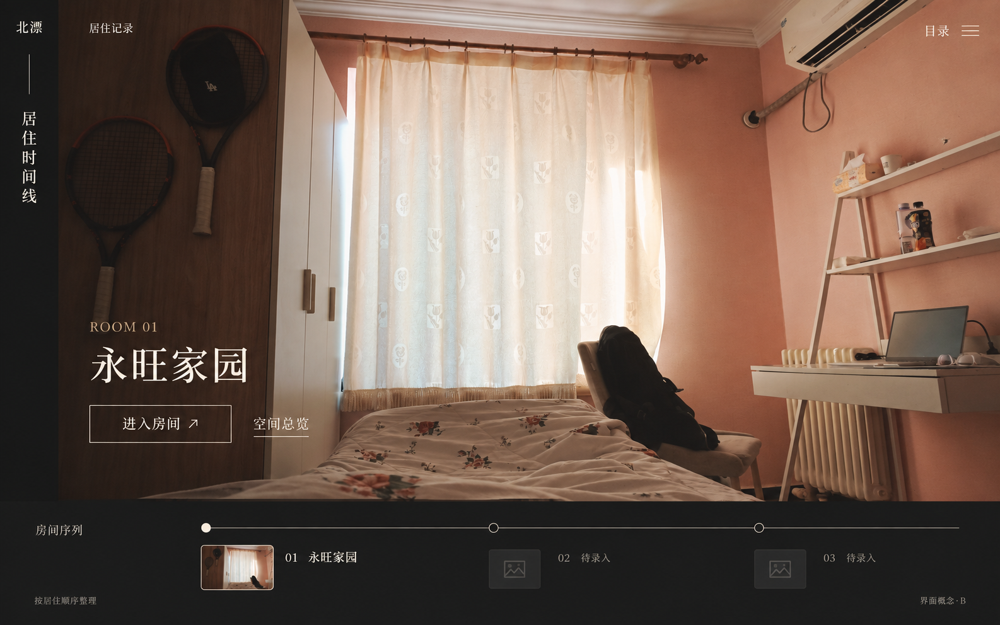

# 北漂 · 居住记录

把在北京住过的出租屋，留成可以重新走进去的记忆。

这是一个个人房间档案：用照片和视频整理空间，在 Blender 中建模，再放进浏览器里自由探索。首页沿居住顺序展开，目前可以进入 **永旺家园**，其他房间保留为“待录入”。



*首页设计参考。进入房间后是可交互的实时三维场景，不是这张静态图片。模型依据照片比例制作，未做实测扫描。*

## 快速开始

推荐 **Windows 10 / 11，64 位**，使用较新的 Edge 或 Chrome，并开启浏览器图形加速。

```powershell
git clone https://github.com/LeonZ03/BeiPiao.git
cd BeiPiao
```

双击根目录的 **`启动房间.cmd`**。

1. 弹出 PowerShell 窗口，自动检查 Node.js 和 Cloudflare。缺少的工具从官方源下载到项目的 `.runtime/`，核对 SHA-256 后使用，无需管理员权限。
2. 浏览器自动打开本地网页：**http://127.0.0.1:48173/**。
3. 窗口另外显示通过页面验证的 **`https://….trycloudflare.com`** 临时公开链接，可以发给手机或其他电脑访问。
4. **关闭这个 PowerShell 窗口即可停止网页服务和隧道**，也可以按 `Ctrl+C`。浏览器不会被关闭。

文件名是 `.cmd`，不是 `.md`；后者是说明文档。请先完整解压或 clone 仓库，不要在 ZIP 压缩包里直接双击。模型和运行素材均在仓库中，不需要 Git LFS、Blender、Python、npm 安装或编译才能看房。

首次下载工具需要能访问 [Node.js](https://nodejs.org/) 和 [Cloudflare 的官方 GitHub 发布页](https://github.com/cloudflare/cloudflared/releases)。已安装 Node.js 22+ 和 cloudflared 时优先使用现成工具；也可以先执行可选初始化：

```powershell
powershell.exe -NoProfile -ExecutionPolicy Bypass -File local-access/init-room.ps1
# 已装 make 的 Windows 用户也可以：make init
```

初始化不创建公网链接。Cloudflare 下载或连接失败不会关闭已经启动的本地网页。只想本地运行、完全不创建隧道时：

```powershell
powershell.exe -NoProfile -ExecutionPolicy Bypass -File local-access/start-room.ps1 -SkipTunnel
```

## 怎么看房

| 操作 | 方式 |
| --- | --- |
| 进入房间 | 首页点击“进入房间”，首次加载显示进度 |
| 环顾 | 鼠标或手指拖动画面；桌面双击画面可锁定鼠标，Esc 释放 |
| 移动 | WASD / 方向键；手机左下方向键 |
| 升降 | Shift 上升、Ctrl 下降；手机右下竖排升降键 |
| 查看整体 | 房间内切换“空间总览”，拖动旋转、滚轮缩放 |
| 回到初始视点 | 点击坐标形状的复位按钮 |
| 沉浸看房 | 右上角按钮 / H，收起界面；手机保留移动键 |
| 操作物品 | 点击窗帘、墙上开关、水龙头、花洒或反锁旋钮，再点可切回 |

手机支持横竖屏。实际帧率由访问设备的 GPU、分辨率和浏览器决定；本地服务和 Cloudflare 只负责传送文件，三维画面在访问者自己的设备上渲染。

每次打开网页默认静音，进入房间后点右上角声音图标开启，再点即可静音。柜门缓慢开合，分别播放提供素材中的开门声与关门声；水龙头使用集中水柱落入陶瓷盆的录音，花洒使用连续喷淋录音，两者分别无缝循环。窗帘、开关和反锁旋钮也有音效。返回首页、切到后台时暂停，沉浸模式仍保留声音开关。水声素材采用 CC0，柜门声音使用提供的录音，仅开启声音后下载，来源与制作方法见 [音效说明](room-site/dist/assets/audio/README.md)。

自由探索中，窗外枝叶随微风轻摆，窗帘下摆、干花和阳光里的微尘有细微动态。关闭窗帘后室内摆动更弱，家具保持静止。返回首页、切换到后台或空间总览时暂停这些动画；开启系统“减少动态效果”时也会停止。

## 常用命令

以下命令在仓库根目录执行；`make` 只是可选快捷方式。

| 用途 | PowerShell 命令 | 可选快捷命令 |
| --- | --- | --- |
| 准备运行工具 | `powershell.exe -NoProfile -ExecutionPolicy Bypass -File local-access/init-room.ps1` | `make init` |
| 本地 + 临时公开链接 | `powershell.exe -NoProfile -ExecutionPolicy Bypass -File local-access/start-room.ps1` | `make start` |
| 仅本地 | 上一条末尾加 `-SkipTunnel` | `make local` |
| 基础回归检查 | `powershell.exe -NoProfile -ExecutionPolicy Bypass -File tests/check.ps1` | `make check` |

启动器还支持 `-Port 49273`（换端口）和 `-NoBrowser`（不自动打开浏览器）。重复双击同一端口不会再启动一套服务。macOS / Linux 可以安装 Node.js 22+ 后运行 `node local-access/serve-room.mjs`；双击入口、自动初始化和窗口关闭清理仅针对 Windows。

开发者可额外运行 CPU 场景回归；普通看房不需要这些开发依赖：

```powershell
npm ci
npm run test:scene
# 显式测试公网连接，会临时公开同一房间，结束后关闭测试隧道：
powershell.exe -NoProfile -ExecutionPolicy Bypass -File tests/test-start-room.ps1 -WithTunnel
```

## 公开链接与常见问题

- **本地网址只能在启动电脑上访问。** 手机需要用 PowerShell 显示的公开链接。
- **临时链接不是永久部署。** 电脑必须开机、联网、不休眠，窗口必须保持打开；重启后网址通常改变。[Cloudflare Quick Tunnel](https://developers.cloudflare.com/cloudflare-one/networks/connectors/cloudflare-tunnel/do-more-with-tunnels/trycloudflare/) 不需要账号或自有域名，但没有可用性保证，不适合承诺长期稳定访问。
- **不是所有网络都能稳定打开 `trycloudflare.com`。** 是否需要 VPN 取决于访问者的网络环境，不能保证国内直连。启动器会验证 HTTPS 返回的确实是房间首页；验证失败会保留本地服务并标出原因，不会把“拿到了 URL”等同于“已经可访问”。
- 公开链接可被知道地址的人访问，当前没有登录限制；服务只提供 `room-site/dist/`，不会公开 `.blend`、日志或整个工程目录。
- 网址与诊断保存在 `local-access/current-link.txt`、`server.err.log`、`tunnel.err.log` 和 `public-check.log`。换端口时文件名带端口后缀。这些文件不提交 Git。
- 若报端口占用，关闭原来启动的窗口，或使用 `-Port` 换一个端口。若下载失败，可以手动安装 Node.js 22+、cloudflared 后重试；不需要修改系统 DNS 或关闭证书验证。
- 改完网页刷新即可；遇到旧缓存可用 `Ctrl+F5`。不要直接双击 `index.html`，浏览器模块和模型需要 HTTP 服务。

## Cloudflare Pages 部署

在线访问：[room.leonz03.dpdns.org](https://room.leonz03.dpdns.org)。备用地址：[beipiao-4op.pages.dev](https://beipiao-4op.pages.dev)。Pages 项目名为 `beipiao`，已连接此仓库的 `main` 分支；推送后自动部署，访问无需运行本地启动器。

2026-09-20 已验证 GitHub 推送自动部署、正式域名 HTTPS 和线上房间加载。后续更新：提交改动 → `git push origin main` → 在 Pages 的 Deployments 中确认对应提交部署成功。交付前检查工作区干净、本地与 `origin/main` 同步；推送成功不代表线上构建已完成。

Cloudflare Pages 托管网站后，访问不再依赖本机开机或临时隧道。连接 GitHub 仓库 `LeonZ03/BeiPiao`，生产分支选 `main`，框架选 `None`，构建命令填 `npm run build:pages`，输出目录填 `.pages-dist`，项目根目录保留仓库根目录，Node.js 使用 22 或更新版本。

构建只复制 `room-site/dist/` 的网页资源，并将模型二进制拆为最多 8 MiB 的文件，适配 Pages 的单文件限制；网页合并后数据与 Blender 原始导出完全一致。源工程和本地模型包不变，本地启动器仍可使用。`.pages-dist/` 为可重复生成的发布目录，不提交 Git。

```powershell
npm run build:pages
npm run test:pages
```

在 Pages 的 Custom domains 中绑定 `room.leonz03.dpdns.org`，按控制台提示配置 DNS，并等待 HTTPS 生效。当前 CNAME 指向 `beipiao-4op.pages.dev`；根域名不绑定此网站。后续推送 `main` 会触发自动构建。哈希命名的模型分块长期缓存，页面和清单重新验证缓存，避免发布后混用旧文件。免费托管不等于国内所有网络均可稳定直连，首次加载速度仍取决于线路与设备。

## 工程结构

```text
启动房间.cmd               Windows 双击启动入口
local-access/              初始化、本地静态服务、Cloudflare 和进程清理
room-site/dist/            网站运行层：网页、Three.js、贴图、模型包（保留现有路径）
rooms/                     按房间分开的建模资料；新增房间从这里开始
  README.md                新房间目录约定与接入步骤
  ROOM_TEMPLATE.md          参考证据、尺寸来源、验收清单模板
  yongwang-jiayuan/         永旺家园
    room.json              建模资料索引（不直接控制网站路由）
    assets/                完整 .blend、独立物件源、材质、原始音效
    scripts/               本房间的建模、精修、素材处理脚本
    docs/                  窗帘/衣柜等定稿、Blender 迁移记录
    history/inputs/        历史精修必需的输入数据
    HISTORY.md             各阶段制作记录与经验
    references/            私人原图/视频，仅本地保存，不入库
    local-history/         旧调查资料、试验脚本与报告，仅本地保留
docs/ui-concepts/          网站共用 UI 方案与 B 方案定稿
tools/                     共用 Pages 构建、Blender 官方 MCP 客户端及依赖说明
tests/                     资源完整性、路由/全屏、场景和启动器回归
AGENTS.md                  AI 建模与维护规范：已确认约束、工作流、踩坑和验收
```

这里的 `dist/` 是直接维护的可运行网站，**必须提交**，不要按一般前端项目习惯将其忽略。权威 Blender 工程是 `rooms/yongwang-jiayuan/assets/full-room/永旺家园-完整场景.blend`；网页使用同目录体系导出的 `scene.json`、`geometry.bin` 和压缩版本。Git 中保留实际模型文件，不依赖作者电脑上的路径。

原始私人参考已从 `Ref/永旺家园/` 移入该房间的 `references/`，保留原文件；旧调查与试验资料归入 `local-history/`。两者不入 Git，也不发布到网站。`analysis/` 只放可再生成的临时检查结果；`.pages-dist/` 是发布产物，`.runtime/`、`node_modules/` 和 `tools/blender-mcp-env/` 是本机依赖。网站实际使用的展示照片与纹理保留在运行资源中。

此次目录迁移的对照见 [房间说明](rooms/yongwang-jiayuan/README.md)。清理目录不能删除 `.blend`、源贴图、定稿或历史输入；过期日志、旧克隆测试副本和 Blender 的 `.blend1` 自动备份无需保留。运行中的服务日志应等服务退出后再清理。

项目使用 **Git 提交管理版本**，不再生成备份压缩包。模型源文件、材质和网页导出物一起保存到对应提交；通过 `git log --oneline` 查看历史，按需要从指定提交恢复相关文件。

## 继续建模 / 增加房间

先读 [AGENTS.md](AGENTS.md)、[新增房间说明](rooms/README.md)，再读 [建模工具说明](tools/README.md)。所有 Blender 操作使用 [Blender Lab 官方 MCP](https://projects.blender.org/lab/blender_mcp)，不是同名第三方插件。

不要重新运行历史 `build-full-room.py` 覆盖精修后的工程，也不要把全部 `refine-*` 依次执行当作初始化。当前 `.blend` 与网页包已是完成品。新房间建立独立工程和资源目录，从参考约束、结构、重点物件、材质光照到浏览器验收逐步推进。无需复制过去的整串试错补丁。

Three.js 的许可证随库保存在 `room-site/dist/vendor/LICENSE`。照片、个人场景与物品标识来自项目参考素材；本仓库暂未为原创内容指定通用开源授权，复用前请与作者确认。
